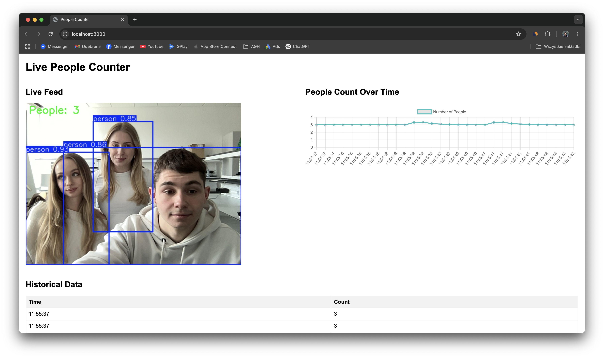

# Real-time People Counter

A real-time people counting application that uses YOLOv8 for person detection and FastAPI for serving a web interface. The application provides live video feed with person detection, historical data tracking, and visual analytics.



## Features

- Real-time person detection using YOLOv8
- Live video feed with bounding boxes and count display
- Historical data tracking with timestamps
- Interactive line chart showing people count over time
- Responsive web interface
- WebSocket-based real-time updates

## Usage

1. Run the application:
```bash
uv run main.py
```

2. Open your web browser and navigate to:
```
http://localhost:8000
```
